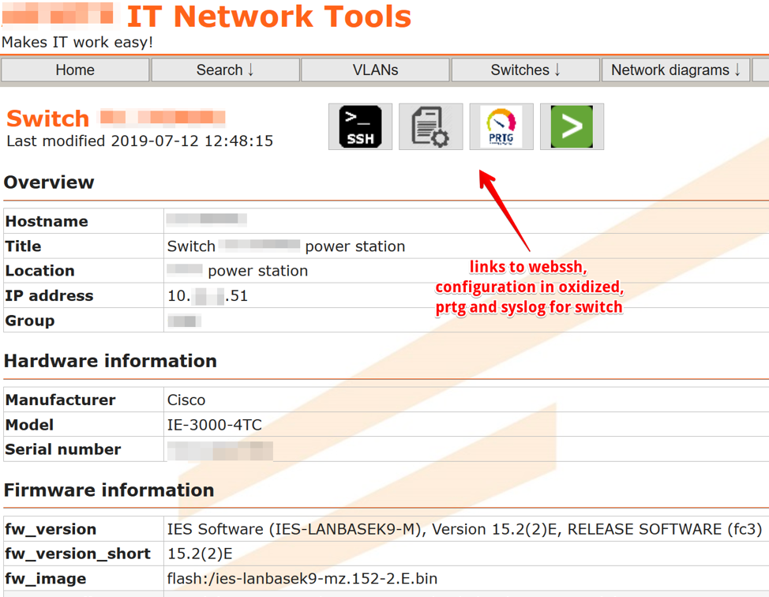

title: "Power to the People: Creating the Web Frontend"
toc_title: Creating the Web Frontend
publish: 2020-02-20

Playbooks and database queries run from CLI are very functional, and can be run from a cronjob
without any human interaction at all (which is, after all, the ultimate goal 😉), but they have
limited appeal to the part of the organization that is less inclined to use Linux command line.
In many cases, that part of the organization is the majority.

Initially, I looked at AWX, the open-source fork of Ansible Tower, but it does not seem (to me)
to be much more than a (nice and elaborate) wrapper around Ansible playbooks - not exactly what
I was looking for.

So when my colleague cooked up a PHP based frontend for the inventory database, I jumped at and
ran with it. I would have preferred a Python-based frontend like flask as I had no prior PHP
experience and would prefer investing my time into Python.

Figure 1: The homepage shows device/model counts and totals

However, PHP turns out to be
straightforward as there’s plenty of online documentation, and it performs well.
With 40.000 interfaces in a table, search-as-you-type still works.

Figure 2: From the search menu, the inventory can be searched on IP,
MAC, switch name, VLAN ID, VLAN name, interface description, device ID and manufacturer ID

The login of the web interface is integrated with AD; for another customer, I have set up a RADIUS
integration for authenticating users in the frontend. Another neat detail: the group menus you see
for Switches and Network Diagrams are based on the groups in the Ansible inventory, and created
dynamically - whenever a new group is defined in Ansible, and a device from the group appears in
the database, an additional menu entry is created for the group.

Clicking on a device name links to a page with the data for that device, including some shortcuts
to common tools, such as WebSSH, through which an SSH session to the devices can be opened,
Oxidized to view device configurations plus some hardware details, PRTG to monitor device details,
and the Splunk syslog server:

Figure 3: Whenever a device is listed in a table, it links to a page with all
the data related to that switch (or stack). This page can be used to launch actions for that
particular device and serves as a launchpad for network management.

As mentioned, when you have all the information in a database, it is trivial to present it on a
page - for instance, the target IOS versions used for the IOS upgrades and compliance reports:

Figure 4: List of target OS versions per device used for the
compliance field/report

